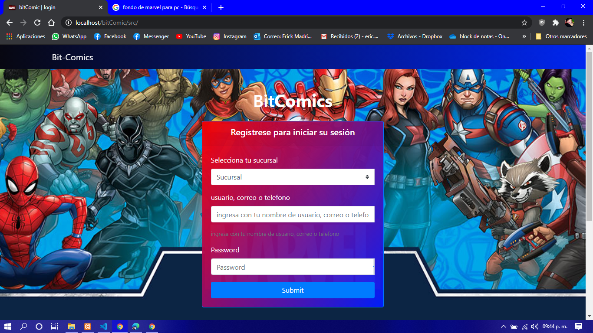
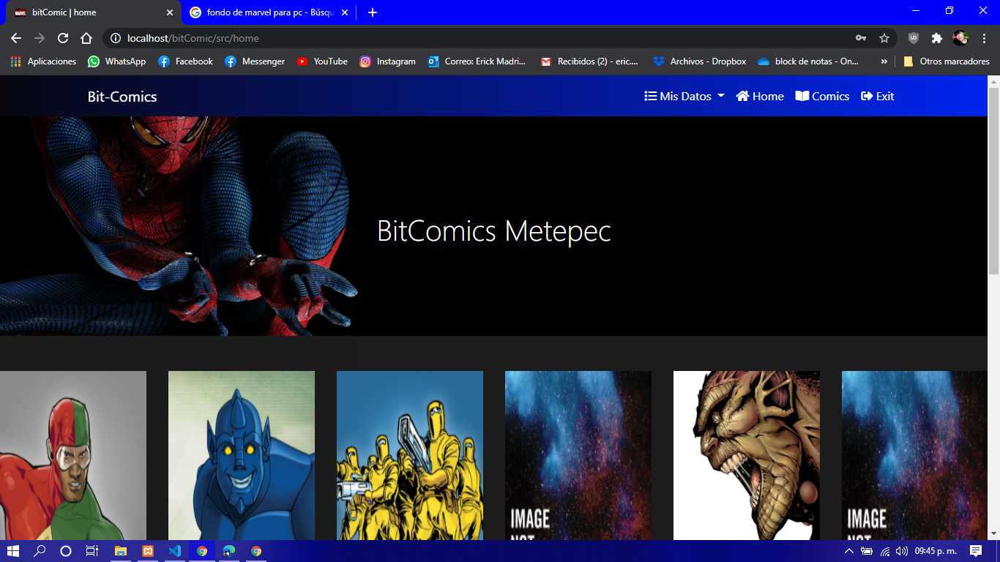
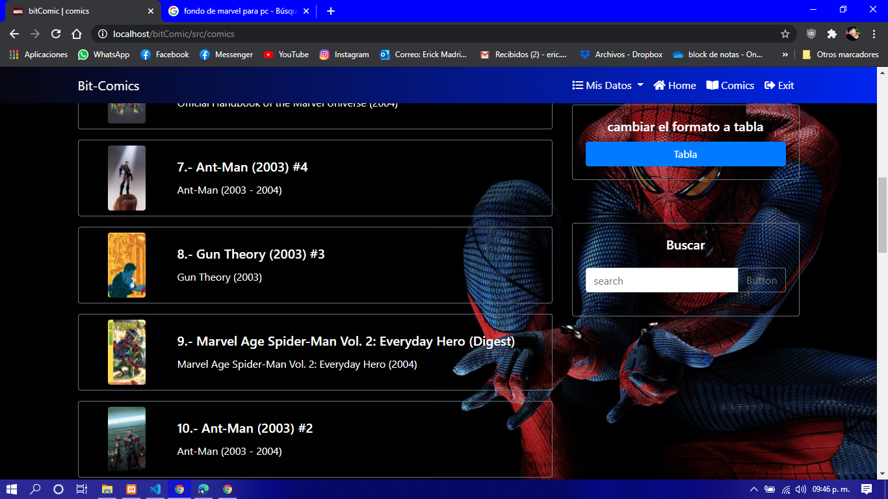
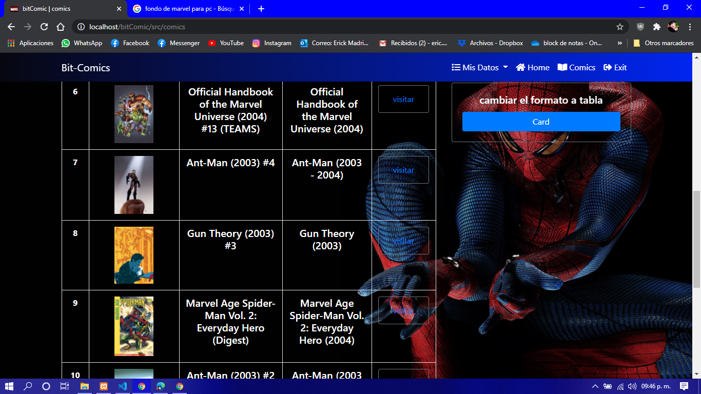
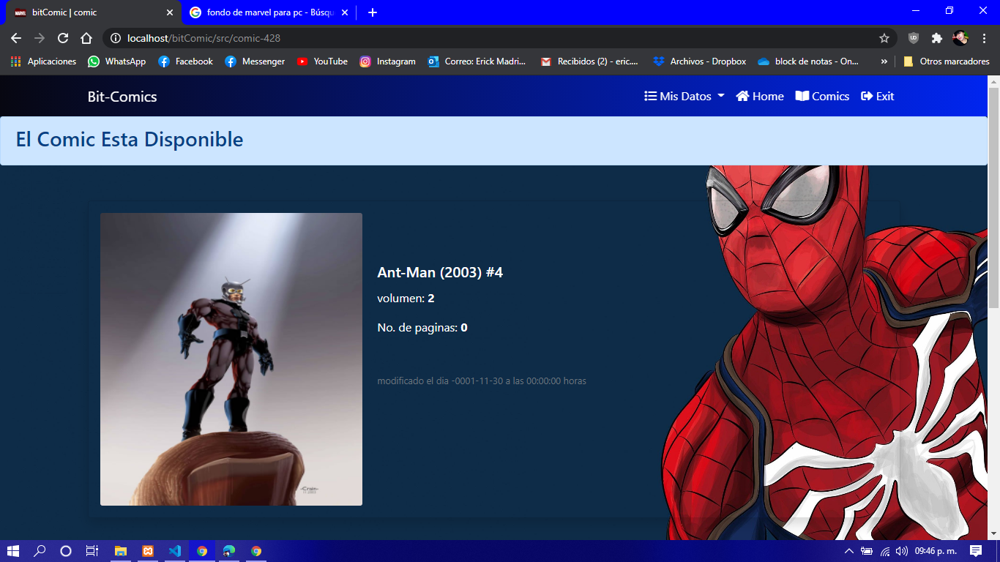
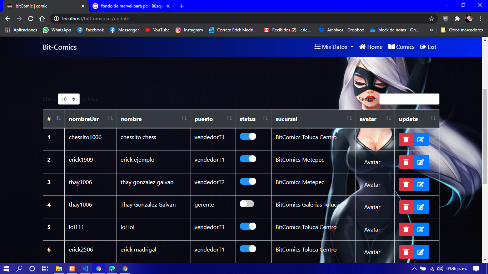
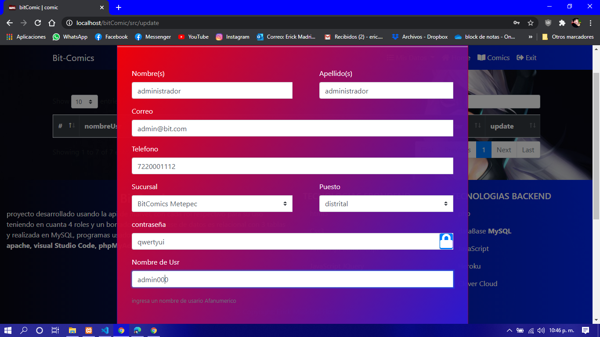

# bitComics

# usuario de super administrador

## datos del usuarios super administrador 

* [sucursal] BitComics Metepec
* [correo] admin@bit.com
* [telefono] 7220001112
* [NomUsuario] admin000
* [password] qwertyui

# Lenguajes usados

* php
* mysql
* html
* css
* javascript 

# Frameworks

* [bootstrap](https://getbootstrap.com/)

# Librerias  

* [bootstrap](https://getbootstrap.com/)
* [fontawesome](https://fontawesome.com)
* [swiperjs](https://swiperjs.com/demos/)
* [jquery](https://jquery.com/)
* [sweetalert2](https://sweetalert2.github.io/)

# Extras

* [heroku.com](https://dashboard.heroku.com/apps)
* [clever-cloud](https://console.clever-cloud.com/)
* [gitHub](https://github.com/)
* [Visual Studio Code](https://code.visualstudio.com/)
* [git](https://git-scm.com/)

# API muestra 

* [Marvel](https://developer.marvel.com/documentation/apiresults)

